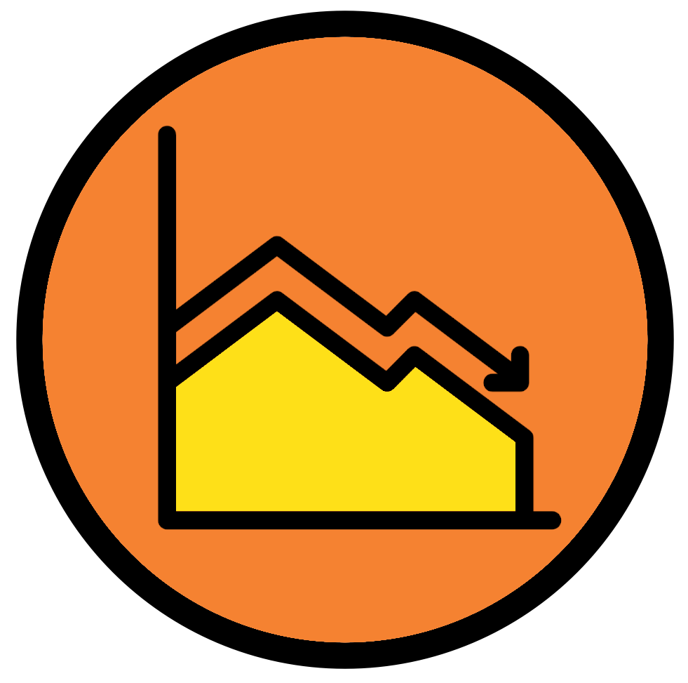

--- 
title: "R primer for omics"
author: "Matthew R. Gemmell"
date: "`r Sys.Date()`"
site: bookdown::bookdown_site
output: bookdown::gitbook
documentclass: book
bibliography: [book.bib, packages.bib]
biblio-style: apalike
link-citations: yes
favicon: figures/NEOF_favicon.png
description: NEOF book for the R primer for omics workshop
cover-image: "figures/NEOF.png"
---

```{r, echo=FALSE}
#Change colour, border, and text of code chunks
#Check style.css for .Rchunk
#https://stackoverflow.com/questions/65627531/change-r-chunk-background-color-in-bookdown-gitbook
#https://bookdown.org/yihui/rmarkdown-cookbook/chunk-styling.html
knitr::opts_chunk$set(class.source="Rchunk") 
```

```{r cite-packages, include = FALSE}
# automatically create a bib database for R packages
# add any packages you want to cite here
knitr::write_bib(c(
  .packages(), 'bookdown', 'webexercises'
), 'packages.bib')
```

```{r, echo=FALSE}
#This book uses ionicons icons using the icons package
#https://github.com/mitchelloharawild/icons
#To set this up on your rstudio use the following commands
# install.packages("remotes")
#remotes::install_github("mitchelloharawild/icons")
#icons::download_fontawesome()
#icons::download_ionicons()
```

<center>
{style="width:300px"}
</center>

# (PART\*) Start {-}
# Introduction
<center>
{style="width:200px; border-radius:15px; background:white"}
</center>

This course will teach you the fundamentals of R, an essential skill for some of our future courses. 
The first day will focus on the basics of R with foundations and objects and covers chapters 1-5. 
In day 2 we will cover chapters 6-11.
We will look at how to read in files and write out files from R. 
Additionally, you will get further practice on the previous materials whilst learning some handy tips and tricks.

## Learning outcomes {-}

At the end of the course learners will be able to:

- Create, edit, run, and save R scripts with RStudio.
- Understand and use fundamental R concepts including operators, annotations, variables, and functions.
- Utilise a variety of R functions.
- Explain the difference between the R classes; Integer, Double, String, and logical.
- Utilise the different R structures; Scalars, Vectors, and Data frames.
- Read in data from files to R and write out data from R to files.
- Subset and manipulate R vectors and data frames with indexing.

## Extra materials {-}

There are extra materials you can attempt after the workshop (chapters 12-18). 
These will allow you to apply your R skills to create plots and carry out some statistics. 
The plots section includes creating line graphs, histograms, scatterplots, and boxplots. 
The statistics section will cover carrying out some basic statistics, don't worry it won't be a statistics lesson. 
Finally, the last section will introduce some harder coding where you'll learn to make loops, use ifs, and create R functions.

## Material contents {-}

These materials will involve theory, practice, exercises, and solutions:

- The theory will explain R concepts and terminology. R terminology can be quite confusing but it is important to learn as it makes asking questions online a lot easier.
- Practice will involve code to run whilst reading through the theory. This will allow you to see the output of R and hopefully help you understand how R works.
- Multiple choice questions (MCQs): These will be used as recap questions at the end of chapters to help solidify the knowledge you are gaining.
- Exercises will give you a task to carry out based on the knowledge and skills you learned from the theory and practise.
- Solutions for the exercise are after the exercise. Please try the exercise before looking at the solutions, however make sure you read the solutions even if you completed the exercise successfully as there is extra information in these sections.
 
Commands are in the following font and colour and should be run in RStudio (These should not be copied into R from this document): 

```{r eval=FALSE}
This is a command 
``` 

## Table of contents {-}

```{r, echo=FALSE, align="centre"}
#Create 2 column dataframe
column_1 <- c(
  '[**Foundations**](#foundations)', 
 '[{style="width:150px; border-radius:5px; border:5px solid white; background:white"}](#foundations)',
   '[**Files & subsetting data**](#filesubsettingchap)', 
 '[{style="width:150px; border-radius:5px; border:5px solid white; background:white"}](#filesubsettingchap)',
   '[**Histograms & line graphs**](#histsandlineschap)', 
 '[{style="width:150px; border-radius:5px; border:5px solid white; background:white"}](#histsandlineschap)',
   '[**Basic stats**](#basicstats)', 
 '[{style="width:150px; border-radius:5px; border:5px solid white; background:white"}](#basicstats)',
   '[**Appendix**](#appendix)', 
 '[{style="width:150px; border-radius:5px; border:5px solid white; background:white"}](#appendix)'
)
column_2 <- c(
  '[**R objects**](#robjectschap)', 
 '[{style="width:150px; border-radius:5px; border:5px solid white; background:white"}](#robjectschap)',
   '[**Handy tips & tricks**](#tipsandtrickschap)', 
 '[{style="width:150px; border-radius:5px; border:5px solid white; background:white"}](#tipsandtrickschap)',
   '[**Scatter plots & box plots**](#scatterandboxchap)', 
 '[{style="width:150px; border-radius:5px; border:5px solid white; background:white"}](#scatterandboxchap)',
   '[**Basic programming**](#basicprogramming)', 
 '[{style="width:150px; border-radius:5px; border:5px solid white; background:white"}](#basicprogramming)',
 "",""
)
table_df <- data.frame(column_1, column_2)
#Kable and kableextra libraries
library(knitr)
library(kableExtra)
#Create table
#ALign both column in centre (align = "cc")
table_df %>%
  kbl(align= "cc", col.names = NULL) %>%
  kable_styling(position = "center")
```

<a rel="license" href="http://creativecommons.org/licenses/by-nc-sa/4.0/"></a><br />This work is licensed under a <a rel="license" href="http://creativecommons.org/licenses/by-nc-sa/4.0/">Creative Commons Attribution-NonCommercial-ShareAlike 4.0 International License</a>.