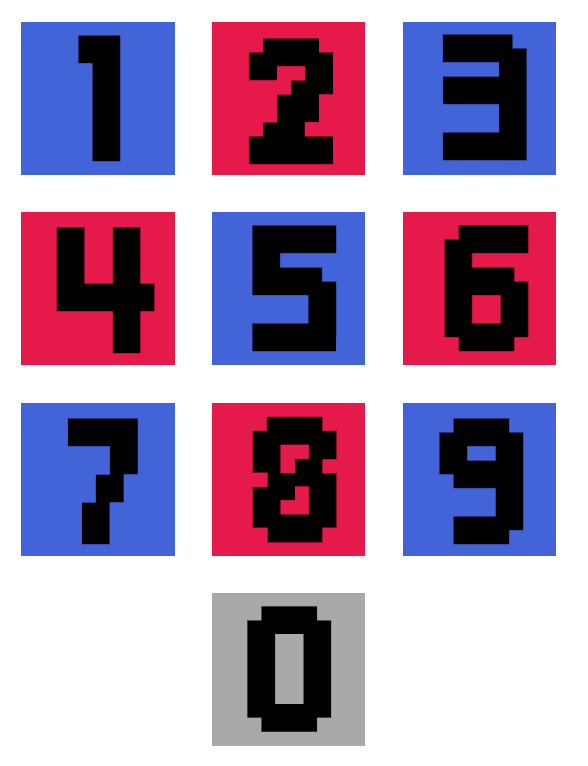
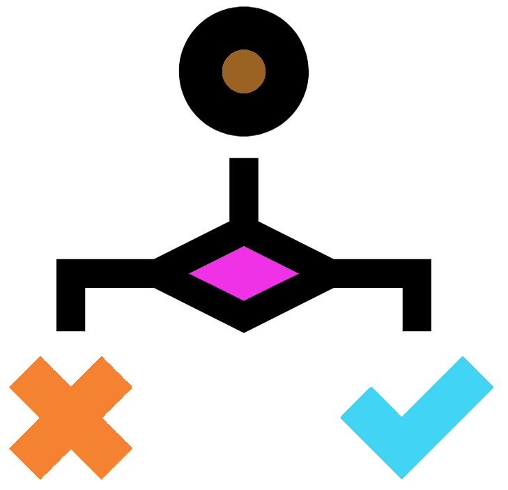

# (PART\*) Objects {.unnumbered}

# R objects {#robjectschap}
<center>
{style="width:200px; background: white; border-radius:5px; border: white 5px solid"}
</center>

In Chapter 2 we learnt how to create a <u id='variable_tooltip'>__variable__</u>. 
This consisted of assigning (`<-`) an __object__ a name. 
In this chapter we will learn about __R objects__. 
There are two major R terminologies to learn to fully understand __R objects__.

- <u id='class_tooltip'>__Class__</u>: An __R object__ will have a specific class. 
The <u id='class_tooltip'>__class__</u> determines what the __object__ is. 
It could be numbers, text, or other types of <u id='class_tooltip'>__classes__</u>.
- <u id='data_structure_tooltip'>__Data structure__</u>: This determines the structure of an __R object__.

The rest of today's plan is to learn about <u id='class_tooltip'>__classes__</u> and <u id='data_structure_tooltip'>__data structures__</u>.

## Code sections{#codesections}
In this section, and for the rest of the course, you will use code sections in your R scripts to separate sections in this book.

First set your working directory to your course directory, create a script, and save it as __"2-Objects.R"__.

Next create a code section at the top of this script called __"Classes"__.

In other words have the below at the top of your script:

```{r eval=FALSE}
# Classes ####
```

## Classes
There are six basic <u id='class_tooltip'>__classes__</u> in R (Also known as the __atomic <u id='class_tooltip'>classes</u>__). 

The four we will learn are:

- <u id='integer_tooltip'>__Integer__</u>
- <u id='double_tooltip'>__Double__</u>
- <u id='string_tooltip'>__String__</u>
- <u id='logical_tooltip'>__Logical__</u>

There are also the <u id='class_tooltip'>classes</u> __complex__ and __raw__.

### Numeric
<center>
{style="width:200px; background: white; border-radius:5px; border: white solid 5px"}
</center>

__Numeric__ <u id='class_tooltip'>__classes__</u> come in two types, <u id='integer_tooltip'>__integer__</u> and <u id='double_tooltip'>__double__</u>. 
<u id='integer_tooltip'>__Integers__</u> and <u id='double_tooltip'>__doubles__</u> are almost identical. 
However, <u id='double_tooltip'>__doubles__</u> contain decimal point information whilst <u id='integer_tooltip'>__integers__</u> do not. 

Most of the time you will only need to know if your data is __numeric__ and you will not need to worry about <u id='double_tooltip'>__doubles__</u> or <u id='integer_tooltip'>__integers__</u>. 
The exception being if you are working with decimals and your decimals are not showing up. 
This probably means that your __object__ has the __<u id='integer_tooltip'>integer</u> <u id='class_tooltip'>class</u>__.

Type and run the following, using the provided annotation to understand what the commands are doing.

__Note:__ Remember you can copy and paste old script.

Use the __function__ `class()` to show the <u id='class_tooltip'>__class__</u> of an R __object__:
```{r eval=FALSE}
#Numeric
#Class of 2
class(2)
#class of 3.14
class(3.14)
#class of 6
class(6)
```

Create a <u id='variable_tooltip'>__variable__</u> with the __name__ "pie" containing the __numeric__ 3.14:
```{r eval=FALSE}
#Creating a variable using the assignment operator
pie <- 3.14
```

Use the <u id='function_tooltip'>__functions__</u> `as.numeric()`, `as.integer()`, and `as.double()` to print the <u id='variable_tooltip'>__variable__</u> as a __numeric__, as an <u id='integer_tooltip'>__integer__</u>, and as a <u id='double_tooltip'>__double__</u>:
```{r eval=FALSE}
#Printing out previously made variable as numeric, integer, and double
as.numeric(pie)
as.integer(pie)
as.double(pie)
```

You can put a <u id='function_tooltip'>__function__</u> as the <u id='variable_tooltip'>__variable__</u> within a <u id='function_tooltip'>__function__</u>. 

Below we will first check the <u id='class_tooltip'>__class__</u> of the __object__ within the "pie" <u id='variable_tooltip'>__variable__</u>. You will note that the <u id='function_tooltip'>__functions__</u> we used previously did not permanently change the __<u id='variable_tooltip'>variable's</u> object__. We can only change a <u id='variable_tooltip'>__variable__</u> if we use the __assignment operator__.

Then we will check the <u id='class_tooltip'>__class__</u> of the __object__ as it is altered by the various `as.` <u id='function_tooltip'>__functions__</u>. 

```{r eval=FALSE}
#Checking the class of our variable
class(pie)
class(as.numeric(pie))
class(as.integer(pie))
class(as.double(pie))
```

__Note:__ Remember to ask for help if you need it!

On a side note, R comes with some inbuilt <u id='variable_tooltip'>variables</u> such as pi:
```{r eval=FALSE}
#The R pi is equal to 3.141593
pi
#assign pi to 3.14
pi <- 3.14
#print out pi to see you have changed the variable's object
pi
#in this case if you want the original R pi object back, we can remove the one we made
rm(pi)
pi
```

Have you been annotating your scripts?

### Logical
<center>
{style="width:200px; background:white; border-radius:15px; border: white solid 5px"}
</center>

<u id='logical_tooltip'>__Logical__</u> values can be __TRUE__ or __FALSE__. 

They are primarily used when comparing objects.

Run the below commands to output <u id='logical_tooltip'>__Logical__</u> values using the various __<u id='logical_tooltip'>logical</u> <u id='operator_tooltip'>operators</u>__.

Note: when `!` is used in <u id='operator_tooltip'>__operators__</u> it means "not". When used, `!` always goes at the front of the operator.

```{r eval=FALSE}
#Logical
# 2 less than 4 
2 < 4
# 2 greater than 4
2 > 4
# 2 less than or equal to 4
2 <= 4
# 2 greater than or equal to 4
2 >= 4
# 2 equal to 4
2 == 4
# 2 not equal to 4
2 != 4
```

It is probably not immediately obvious how useful <u id='logical_tooltip'>__logicals__</u> are, but you'll see their usefulness later in the course.

### String
<center>
{style="width:200px; background: white; border-radius:5px; border: 5px white solid"}
</center>

<u id='string_tooltip'>__Strings__</u> are text and can be modified in R in ways you would normally want to modify text. 
They are called <u id='string_tooltip'>__strings__</u> as they are strings of characters. 
<u id='string_tooltip'>__Strings__</u> are flanked by quote marks. 
Double quotes (`""`) are preferred but single quotes can also be used (`''`).

Type and run the below examples to get some practice with <u id='string_tooltip'>__strings__</u>.

A __<u id='string_tooltip'>string</u> object__ can consist of a <u id='string_tooltip'>string</u> containing one __character__:
```{r eval=FALSE}
#String
one_character_string <- "A"
one_character_string
```

A __<u id='string_tooltip'>string</u> object__ can consist of a <u id='string_tooltip'>string</u> containing multiple __characters__:
```{r eval=FALSE}
word_string <- "alphabet"
word_string
```

A <u id='string_tooltip'>__string__</u> can contain all the different characters and any number of them. 
The only exception is that if you try to put a double quote in your <u id='string_tooltip'>string</u> it will cause an issue.
```{r eval=FALSE}
long_string <- "Strings can be long and contain more than letters. \\.("
long_string
```

A <u id='string_tooltip'>__string__</u> doesn't need letters, it can consist of only numbers. 
Note the terms <u id='string_tooltip'>__string__</u> and __character__ can be used interchangeably.
```{r eval=FALSE}
number_string <- "1066"
number_string
class(number_string)
```

You can convert a __numeric__ to a <u id='string_tooltip'>__string/character__</u>.
```{r eval=FALSE}
number <- 1066
numeric_to_string <- as.character(number)
numeric_to_string
class(numeric_to_string)
```

An appropriate <u id='string_tooltip'>__string__</u> can be converted to a __numeric__. 
This is useful as mathematical <u id='operator_tooltip'>__operators__</u> will not work with <u id='string_tooltip'>__strings__</u>.
```{r eval=FALSE}
#will get an error as strings and maths don't mix
"6" - 3
#will work as maths and numerics work
as.numeric("6") - 4
#Below will not work as only strings containing numbers can be converted to numeric
as.numeric("not_a_number_12")
```

You can use certain __<u id='logical_tooltip'>logical</u> <u id='operator_tooltip'>operators</u>__ to compare <u id='string_tooltip'>__strings__</u> though:
```{r eval=FALSE}
"character" == "character"
"1066" != "character"
"numeric" == "string"
```

The __paste() <u id='function_tooltip'>function</u>__ is very useful to combine two or more <u id='string_tooltip'>__strings__</u> into one.
```{r eval=FALSE}
paste("The following is a string:", long_string) 
paste(number_string, "and the", word_string)
#By default paste will put a space (sep = " ") between each string you provide
#You can use the sep option to specify your own
paste("However", " this is separated by a comma", sep = ",")
#Or you can make it so there is no separator
paste("no separator",numeric_to_string, sep = "")
#Alternatively you can use paste0()
#Where there is no separator by default (sep ="")
paste0("no separator",numeric_to_string)
```

## Code section continued
After all that you will have some nice code and annotations in your script editor for the __Classes__ code section.

Making a code section is not very useful until you have multiple code sections. 
To show this create a new code section at the bottom of your script called __"Data structures"__. 
This new code section will be used for the next section.

```{r eval=FALSE}
# Data structures ####
```

With the new code section created we can now see why code sections are so useful. 
Go to the text that denotes the first code section (__"Classes"__). 
Look between the numbers on the left that signify the line number, and the text. 
You will see an arrow pointing downwards. 
You can click that arrow and it will collapse the code section. 
Click the arrow, now pointing right, and it will expand the code section. 
This is super useful so you can hide code sections in your script that you don't currently need to look at.

<center>
{style="width:200px; border-radius:5px"}
</center>

With the __"Classes"__ code section collapsed let us continue to the next section. 
There will be less annotations in this book as I expect you will make your own now.

## Data structures

<u id='data_structure_tooltip'>__Data structures__</u> describe how data is structured in an __object__. 
We will go into 3 main types of <u id='data_structure_tooltip'>__data structures__</u>.

- <u id='scalar_tooltip'>__Scalar__</u>
- <u id='vector_tooltip'>__Vectors__</u> & __Lists__
- <u id='matrix_tooltip'>__Matrices__</u> & <u id='data_frame_tooltip'>__Data frames__</u>

### Scalar
<center>
{style="width:100px; background: white; border-radius:5px"}
</center>

A <u id='scalar_tooltip'>__scalar__</u> consists of one value in an object. 
This can be one <u id='string_tooltip'>__string__</u>, one __numeric__, one <u id='logical_tooltip'>__logical__</u> etc. 
We have only been working with <u id='scalar_tooltip'>__scalars__</u> thus far but this is about to change. 

### Vectors & Lists
<center>
{style="width:300px; background: white; border-radius: 5px; border: 5px white solid"}
</center>

A __R object__ can hold multiple values.
Many <u id='data_structure_tooltip'>__data structures__</u> can do this with the simplest being a <u id='vector_tooltip'>__vector__</u>.

A <u id='vector_tooltip'>__vector__</u> can be created with the `c()` <u id='function_tooltip'>__function__</u>. 
This function will combine the provided objects into a single <u id='vector_tooltip'>__vector__</u> or __list__.

<u id='vector_tooltip'>__Vectors__</u> and __lists__ are both 1-dimensional <u id='data_structure_tooltip'>__data structures__</u>. 
<u id='vector_tooltip'>__Vectors__</u> can only contain one <u id='class_tooltip'>__class__</u> (homogeneous) whilst __lists__ can contain multiple (heterogeneous). 
There is more to __lists__ but we will not go into them.

Run the following commands to produce <u id='variable_tooltip'>__variables__</u> which contain <u id='vector_tooltip'>__vectors__</u>.

```{r eval=FALSE}
number_vec <- c(1,2,4,8,16)
number_vec
number_series_vec <- 1:6
number_series_vec
animals <- c("Whale","Seal","Hedgehog","Mouse","Owl","Squirrel","Vole","Shrew")
animals
```

Elements of a <u id='vector_tooltip'>__vector__</u> can be accessed through their indices:

```{r eval=FALSE}
birds <- animals[5]
birds
aquatic <- animals[1:2]
aquatic
rodents <- animals[c(4,6,7)]
rodents
mammals <- animals[-5]
mammals
```

You can use <u id='operator_tooltip'>__operators__</u> and <u id='function_tooltip'>__functions__</u> on a <u id='vector_tooltip'>__vector__</u>. 
When you do each <u id='scalar_tooltip'>__scalar__</u> within the <u id='vector_tooltip'>__vector__</u> will be acted upon.
```{r eval=FALSE}
number_vec - 1
number_vec * 2
log(number_vec)
length(rodents)
```

Some <u id='function_tooltip'>__functions__</u> are specifically used for <u id='vector_tooltip'>__vectors__</u>:
```{r eval=FALSE}
mean(number_vec)
summary(number_vec)
```

We can also test the values within <u id='vector_tooltip'>__vectors__</u>:
```{r eval=FALSE}
aquatic == "Whale"
number_vec > 4
number_vec[number_vec > 4]
```

The `paste()` <u id='function_tooltip'>__function__</u> can be used to paste __<u id='string_tooltip'>string</u> <u id='scalar_tooltip'>scalars</u>__ to other __<u id='string_tooltip'>string</u> <u id='scalar_tooltip'>scalars</u>__ or to __<u id='string_tooltip'>string</u> <u id='vector_tooltip'>vectors</u>__:
```{r eval=FALSE}
paste("Animals", animals)
bird_or_mammal <- c("mammal","mammal","mammal","mammal","bird","mammal","mammal","mammal")
paste(animals, bird_or_mammal, sep = ":")
paste(animals, " is a ", bird_or_mammal, sep = "")
```

### Data frames & Matrices
<center>
{style="width:200px; background:white; border-radius:5px; border: 5px white solid"}
</center>

<u id='data_frame_tooltip'>__Data frames__</u> & <u id='matrix_tooltip'>__matrices__</u> are 2-dimensional data structures as they have rows and columns.

A <u id='matrix_tooltip'>__matrix__</u> only contains 1 <u id='class_tooltip'>__class__</u> (homogeneous). A <u id='data_frame_tooltip'>__data frame__</u> can contain multiple <u id='class_tooltip'>__classes__</u> (heterogeneous), but each column can only contain one <u id='class_tooltip'>__class__</u>. 

Most of the time <u id='data_frame_tooltip'>__data frames__</u> and <u id='matrix_tooltip'>__matrices__</u> can be treated the same. Because of this I generally use <u id='data_frame_tooltip'>__data frames__</u> and so we will focus on them.

R comes with a set of pre-loaded data. If you are interested you can use the <u id='function_tooltip'>__function__</u> `data()` to see the full list.

We will have a quick look at the dataset "mtcars". This is a <u id='data_frame_tooltip'>__data frame__</u> containing information on various cars. To look at the <u id='data_frame_tooltip'>__data frame__</u> in the __console window__ run the below.

```{r eval=FALSE}
mtcars
```

The above shows the info in the __console window__. 
However we can have a better look at it in RStudio if we save it as a <u id='variable_tooltip'>__variable__</u> in our __environment__ and then click the <u id='variable_tooltip'>__variable__</u> name on the __Environment pane__ of the __"environment and history"__ __window__.

```{r eval=FALSE}
cars_info <- mtcars
```

Now the <u id='variable_tooltip'>__variable__</u> will be listed in your __Environment pane__ in the __"environment and history" window__ . 
Click on the name "cars_info" in the __Environment pane__. 
A tab in your __script editor__ will open so you can have a good look at the contents of the <u id='data_frame_tooltip'>__data frame__</u>.

When you are ready, close the "cars_info" tab and remove the <u id='variable_tooltip'>__variable__</u> with the below command.

```{r eval=FALSE}
rm(cars_info)
```

Now it is time to create our own <u id='data_frame_tooltip'>__data frame__</u>.

First we will create three <u id='variable_tooltip'>__variables__</u> containing <u id='vector_tooltip'>__vectors__</u>. 
These will be our three columns.

```{r eval=FALSE}
Crab <- c(10,1,1)
Oystercatcher <- c(5,6,4)
Starfish <- c(3,3,7)
```

Now let us create the <u id='data_frame_tooltip'>__data frame__</u>.

```{r eval=FALSE}
#Using the function data.frame to create a data frame
beach_df <- data.frame(Crab,Oystercatcher,Starfish)
```

Look at the <u id='variable_tooltip'>__variable__</u> "beach_df" (it is useful to use "df" in __<u id='variable_tooltip'>variable</u> names__ to signify it is a <u id='data_frame_tooltip'>__data frame__</u>) and you will see that each <u id='vector_tooltip'>__vector__</u> has become a column. 
The __<u id='variable_tooltip'>variable</u> names__ have become the column names (this is why we used capital letters in the __<u id='variable_tooltip'>variable</u> names__).

You can think of <u id='data_frame_tooltip'>__data frames__</u> in three different ways:

- A list of columns
- A list of rows
- A table

Look at the column and row names with two new <u id='function_tooltip'>__functions__</u>.
```{r eval=FALSE}
colnames(beach_df)
row.names(beach_df)
```

We can use the <u id='function_tooltip'>__function__</u> `row.names()` and the __assignment operator__ to change the row names to something more useful.
```{r eval=FALSE}
row.names(beach_df) <- c("Formby","West Kirby","Crosby")
```

Now look at your "beach_df" <u id='data_frame_tooltip'>__data frame__</u> to see the difference.

## Objects MCQs
<center>
{style="width:200px; background: white; border-radius:5px; border: white solid 5px"}
</center>

Super! Understanding the different classes and data structures is vital to understanding R.

Try choosing the correct answer for each of the below MCQs.

```{r, echo = FALSE}
opts_p <- c(answer="Numeric", "Logical","String")
```
1. What __class__ are numbers normally stored in? `r longmcq(opts_p)`

```{r, echo = FALSE}
opts_p <- c("Numeric","Logical",answer="String")
```
2. What __class__ is text normally stored in? `r longmcq(opts_p)`

```{r, echo = FALSE}
opts_p <- c("Numeric",answer="Logical","String")
```
3. What __class__ has the value of TRUE or FALSE? `r longmcq(opts_p)`

```{r, echo = FALSE}
opts_p <- c("Scalar", "Vector", answer="Data frame")
```
4. Which __data structure__ is 2-dimensional and heterogeneous (can contain multiple __classes__)? `r longmcq(opts_p)`

```{r, echo = FALSE}
opts_p <- c("Scalar", answer="Vector", "Data frame")
```
5. Which __data structure__ is 1-dimensional and homogeneous (can only contain 1 __class__)? `r longmcq(opts_p)`

```{r, echo = FALSE}
opts_p <- c(answer="Scalar", "Vector", "Data frame")
```
6. Which __data structure__ consists of only one value? `r longmcq(opts_p)`

```{r, echo = FALSE}
opts_p <- c("`c()`", answer="`class()`", "`paste()`")
```
7. Which __function__ can show the __class__ of an R __object__? `r longmcq(opts_p)`

```{r, echo = FALSE}
opts_p <- c("`c()`", "`class()`", answer="`paste()`")
```
8. Which __function__ can be used to combine __strings__? `r longmcq(opts_p)`

```{r, echo = FALSE}
opts_p <- c(answer="`c()`", "`class()`", "`paste()`")
```
9. Which __function__ can be used to create a __vector__? `r longmcq(opts_p)`

```{r, echo = FALSE}
opts_p <- c(answer="`<`", "`!=`", "`>=`")
```
10. Which __logical operator__ means "less than"? `r longmcq(opts_p)`

```{r, echo = FALSE}
opts_p <- c("`<`", answer="`!=`", "`>=`")
```
11. Which __logical operator__ means "not equal to"? `r longmcq(opts_p)`

```{r, echo = FALSE}
opts_p <- c("`<`", "`!=`", answer="`>=`")
```
12. Which __logical operator__ means "greater than or equal to"? `r longmcq(opts_p)`

There was quite a lot to go through in this chapter, so let us reinforce it all with exercise!

```{r, echo=FALSE}
#Tippy tooltips
tippy::tippy_this(elementId = "operator_tooltip", 
                  tooltip = "+, -, /, *, etc.",
                  arrow = TRUE, placement = "bottom")
tippy::tippy_this(elementId = "variable_tooltip", 
                  tooltip = "Container of an R object with a name",
                  arrow = TRUE, placement = "bottom")
tippy::tippy_this(elementId = "function_tooltip", 
                  tooltip = "Named block of code that performs a specific task",
                  arrow = TRUE, placement = "bottom")
tippy::tippy_this(elementId = "class_tooltip", 
                  tooltip = "Object data type, e.g. integer, double, string, and logical",
                  arrow = TRUE, placement = "bottom")
tippy::tippy_this(elementId = "data_structure_tooltip", 
                  tooltip = "Object structure type, e.g. scalar, vector, and data frame",
                  arrow = TRUE, placement = "bottom")
tippy::tippy_this(elementId = "integer_tooltip", 
                  tooltip = "Number without decimal points",
                  arrow = TRUE, placement = "bottom")
tippy::tippy_this(elementId = "double_tooltip", 
                  tooltip = "Number with decimal points",
                  arrow = TRUE, placement = "bottom")
tippy::tippy_this(elementId = "string_tooltip", 
                  tooltip = "Text",
                  arrow = TRUE, placement = "bottom")
tippy::tippy_this(elementId = "logical_tooltip", 
                  tooltip = "TRUE or FALSE",
                  arrow = TRUE, placement = "bottom")
tippy::tippy_this(elementId = "scalar_tooltip", 
                  tooltip = "A single value in a object",
                  arrow = TRUE, placement = "bottom")
tippy::tippy_this(elementId = "vector_tooltip", 
                  tooltip = "Homogenous 1-dimensional data structure",
                  arrow = TRUE, placement = "bottom")
tippy::tippy_this(elementId = "matrix_tooltip", 
                  tooltip = "Homogeneous 2-dimensional data structure",
                  arrow = TRUE, placement = "bottom")
tippy::tippy_this(elementId = "data_frame_tooltip", 
                  tooltip = "Heterogeneous 2-dimensional data structure. Each column is homogeneous",
                  arrow = TRUE, placement = "bottom")
```