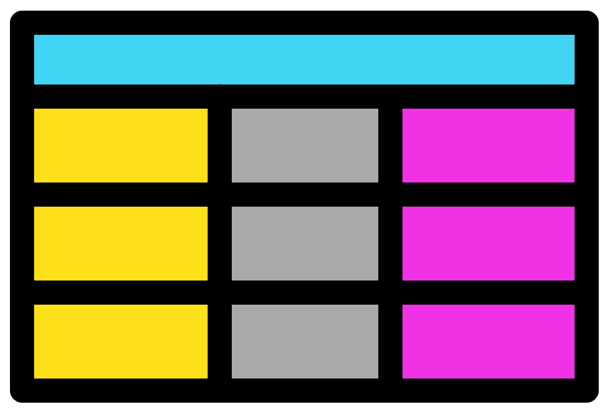

# (PART\*) Files & Subsetting {.unnumbered}

# Files and subsetting data {#filesubsettingchap}
<center>
{style="width:200px; background: white; border-radius:5px; border: white 5px solid"}
</center>

## Reading from a file
<center>
{style="width:400px; background:white; border-radius:15px"}
</center>

In [chapter 4](#robjectschap) we created <u id='data_frame_tooltip'>__data frames__</u> with R <u id='function_tooltip'>__functions__</u>. 
This was useful to help understand how <u id='data_frame_tooltip'>__data frames__</u> work in R. 
However, in real life you will most likely not do this very often. 
Instead you will have data files you need to analyse with R.

You can get your data into R by having R __read__ your file.

### Directory and file setup

Prior to using a file you will need to acquire it. 

- Make a directory/folder called "Chapter_6" within your main directory/folder for this workshop. 
- Download the file [Liverpool_beaches.csv](https://neof-workshops.github.io/R_j4c0xh/downloads/Liverpool_beaches.csv) into "Chapter_6". 
- Set your working directory to this new directory ([Directories](#directories)). You will stay here for this chapter.

### Viewing the file
<center>
{style="width:200px; background:white; border-radius:15px"}
</center>

The next task to carry out is to __read__ in the file "Liverpool_beaches.csv". 
Before __reading__ in the file we can check the contents of the file. 
This can be carried out by opening it with notepad (or similar text tool) or viewing the file with RStudio. 

To view the file with RStudio:

- Use the __Files pane__ of the __MISC window__ to navigate to the directory containing the file
- Click on the file name and then click "View File"
- This will open a tab in the __Source window__ matching the file name

You will notice that the values are separated by commas as this is a "comma separated value" (.csv) file. Additionally, this is the same data as the "beach_df_2" <u id='data_frame_tooltip'>__data frame__</u> you created in the [chapter 5 exercises](#robjectexercises).

__Note__: Create a new R script file called __"3-Files_and_subsetting.r"__ for this chapter's scripts.

### read.csv()
<center>
{style="width:200px; background:white; border-radius:15px"}
</center>

There are various <u id='function_tooltip'>__functions__</u> to __read__ in files into R. 
My favourite is `read.csv()`. 
Use this function to __read__ in the file "Liverpool_beaches.csv":
```{r eval=FALSE}
liv_beaches_df <- read.csv("Liverpool_beaches.csv")
```

Have a look at the newly created <u id='data_frame_tooltip'>__data frame__</u>. 
Is it how you would like it?

The row names are empty and the beach names are in the first column. 
We'll fix this so the beach names are the row names. 
This can be carried out by including the option `row.names = 1` to specify the 1st column will be the row names:
```{r eval=FALSE}
liv_beaches_df <- read.csv("Liverpool_beaches.csv", row.names = 1)
```

We now know how to __read__ in a csv file with `read.csv`. 

### TSV files
<center>
{style="width:200px; background:white; border-radius:15px"}
</center>

For our next task we will __read__ a tab separated file. 

Download [Global_eco_footprint.tsv](https://neof-workshops.github.io/R_j4c0xh/downloads/Global_eco_footprint.tsv) into your "Chapter_6" folder/directory. 
This file contains the 2023 global ecological footprint information. 
The ecological footprint measures the ecological assets that a given population requires to produce the natural resources it consumes.

`r hide("More info on Global_eco_footprint.tsv")`
More info can be found in the following link: https://www.kaggle.com/datasets/jainaru/global-ecological-footprint-2023.
`r unhide()`

Use `read.csv()` to __read__ in the file. We'll set the option `row.names = 1` again but also include the option `sep = "\t"`. This option specifies the columns are separated (`sep`) by tabs (`"\t"`).

```{r eval=FALSE}
global_eco_footprint <- read.csv("Global_eco_footprint.tsv", 
                        row.names = 1, sep = "\t")
```

Look at the resulting <u id='data_frame_tooltip'>__data frame__</u> and you will notice the column names have been changed by R. This is annoying but thankfully there is an easy fix. __Read__ in the data again with the inclusion of the parameter `check.names = FALSE`. This will stop the function `read.csv()` from 'checking' and 'fixing' the column names. I always use this option.

```{r eval=FALSE}
global_eco_footprint_df <- read.csv("Global_eco_footprint.tsv", 
                                 row.names = 1, sep = "\t", 
                                 check.names = FALSE)
```

### Excel files and R
<center>
{style="width:200px"}
</center>

You may want to open excel files with R. Normally to do this I open the file in excel and save it as a .csv or a tab separated file and __read__ this into R. Alternatively there are R packages that can directly __read__ in excel files. If this is something you would like to do you can look at the following package:

https://readxl.tidyverse.org/

An important note is that __reading__ in a file into R will not change the file. You are creating a new R __object__. Modifying this __object__ will not alter the original file. Later in the materials we will look into how to create new files or overwrite files by __writing__.

## Subsetting data
<center>
{style="width:200px; background: white; border-radius:5px; border: white solid 5px"}
</center>

R allows you to specify specific points in __R objects__. This is one of the primary reasons R is so useful and flexible. With good use of <u id='assignment_tooltip'>__assignment operators__</u> this allows for the subsetting of <u id='variable_tooltip'>__variables__</u>.

### Vectors
<center>
{style="width:200px; background:white; border-radius:15px"}
</center>

We will start with <u id='vector_tooltip'>__vectors__</u>. 
Before carrying out and subsetting let us create some new <u id='vector_tooltip'>__vectors__</u>. 
We will use a new <u id='function_tooltip'>__function__</u> to create these, `seq()`.

__Tip__: Look at the resulting <u id='vector_tooltip'>__vectors__</u> and, use `?seq()` or search online to understand the `seq()` <u id='function_tooltip'>__function__</u> better.
```{r eval=FALSE}
even_seq <- seq(from = 0, to = 8, by = 2)
odd_seq <- seq(from = 1, to = 9, by = 2)
long_seq <- seq(from = 10, to = 300, by = 10)
```

Grand! Now let us subset the <u id='vector_tooltip'>__vectors__</u> with square brackets `[]`.

#### Foundational vector subsetting {-}

<u id='vector_tooltip'>__Vectors__</u> are one-dimensional, we therefore provide the square brackets with one number or one range of numbers. 
The number/s we provide in the square brackets are the index.

Try out indexing/subsetting the <u id='vector_tooltip'>__vectors__</u>.

```{r eval=FALSE}
even_seq[2]
odd_seq[1]
long_seq[10]
even_seq[2:3]
odd_seq[1:4]
long_seq[21:24]
long_seq[24:21]
even_seq[c(2,3)]
odd_seq[c(1,3,2,5)]
long_seq[c(1,21,21:24,24:21,1)]
#As long as the contents within the [] equal numbers they will work
even_seq[seq(from = 1, to = 3, by = 2)]
even_seq[seq(from = 0, to = 5, by = 3)]
long_seq[seq(from = 1, to = 19, by = 2)]
even_seq[1*2]
odd_seq[2/1]
long_seq[(1:10)*2]
```

#### Subsetting and NAs {-}

The <u id='vector_tooltip'>__vectors__</u> even_seq and odd_seq have the indexes 1,2,3,4, and 5 as they each contain 5 <u id='scalar_tooltip'>__scalars__</u>. 
What if we try to use a higher number to index than is available?
```{r eval=FALSE}
even_seq[6]
even_seq[c(4,7)]
odd_seq[3:9]
```

As you can see the above all work with no complaints. 
Any indexes that are out of range will return a `NA` value. 
`NA` stands for 'Not Available'. 
We will not go into how `NA` works in R too much. 
The most important thing to know about `NA` is that you will most likely get `NA` if you use <u id='operator_tooltip'>__operators__</u> or <u id='function_tooltip'>__functions__</u> with `NA`. 
Below are a few examples:

```{r eval=FALSE}
#Will give NA
1 + NA
2 - NA
even_seq[2] * NA
odd_seq[5] / NA
#mean() function without NA
mean(even_seq[2:5])
#mean() function with NA
mean(c(1,2,3,4,5,NA))
mean(even_seq[2:7])
```

#### Inverted subsetting {-}

Above we subsetted <u id='vector_tooltip'>__vectors__</u> by specifying which indexes we want. 
We can also specify which indexes we don't want:

```{r eval=FALSE}
even_seq[-2]
odd_seq[-3:-5]
long_seq[c(-1,-2,-6)]
```

#### Subsetting with `rep()` {-}

The `rep()` <u id='function_tooltip'>__function__</u> will replicate a __<u id='scalar_tooltip'>scalar</u>/<u id='vector_tooltip'>vector</u>__ a specified amount of times. 
We will use this <u id='function_tooltip'>__function__</u> to overwrite our previously created <u id='variable_tooltip'>__variables__</u> with longer versions:
```{r eval=FALSE}
#Replicate vector even_seq 2 times
rep(x = even_seq, 2)
#Replicate vector even_seq 4 times and then assign even_seq as the newly created vector
even_seq <- rep(x = even_seq, 4)
#More examples
odd_seq <- rep(x = odd_seq, 4)
long_seq <- rep(x = long_seq, 3)
```

#### Logical subsetting {-}

<u id='logical_tooltip'>__Logical__</u> <u id='operator_tooltip'>__operators__</u> can be used as indexes to subset <u id='vector_tooltip'>__vectors__</u>. 
Having a logical expression (i.e. 1 > 2) as the index will cause all TRUE positions to be included and all FALSE positions to be excluded.

__Tip__: If it is difficult to deduce what the below commands are doing you can run the part in the square brackets by itself. Remember if you highlight code in the __script editor__ it will only run that part, excluding unhighlighted parts of script in the same line.

```{r eval=FALSE}
even_seq > 3
even_seq[even_seq  > 2]
odd_seq[odd_seq <= 1 ]
long_seq <- long_seq[long_seq < 50]
```

#### Modulus (`%%`) {-}

We will quickly look at a new <u id='operator_tooltip'>__operator__</u>, `%%`. This is the modulus <u id='operator_tooltip'>__operator__</u>, it divides two numbers and gives the remainder of the division.

With the modulus <u id='operator_tooltip'>__operator__</u>, <u id='logical_tooltip'>logical</u> expressions, and subsetting we can extract even or odd numbers from a <u id='vector_tooltip'>__vector__</u>:
```{r eval=FALSE}
#First some basic modulus examples
2%%2
3%%2
#Create a vector with numbers 0 to 9
single_digit_vec <- 0:9
#Extract even numbers then odd numbers from the vector
#We carry this out by determining if numbers are divisible by 2 or not
even_seq <- single_digit_vec[(single_digit_vec %% 2) == 0 ]
odd_seq <- single_digit_vec[(single_digit_vec %% 2) != 0]
#We can determine which numbers in a vector are divisible by any specific number
#Divisible by 3
#remember variable names cannot start with numbers
divis_3_vec <- single_digit_vec[(single_digit_vec %% 3) == 0]
#Divisible by 7
divis_7_vec <- single_digit_vec[(single_digit_vec %% 7) == 0]
#Try out other numbers!
```

### Data frames
<center>
{style="width:200px; background:white; border-radius:15px"}
</center>

<u id='data_frame_tooltip'>__Data frames__</u> can be subset similar to <u id='vector_tooltip'>__vectors__</u>. 
As with <u id='vector_tooltip'>__vectors__</u> you can use `[]`. 
Additionally, `$` can be used to subset <u id='data_frame_tooltip'>__data frames__</u>.

Square brackets must be provided indexes for rows and for columns. 
The structure for this is `df[row,column]`. 
It is very useful to remember that R always wants rows first then columns second.

#### Read in Parks biodiversity data frame {-}

To practice subsetting <u id='data_frame_tooltip'>__data frames__</u> with square brackets we will __read__ in a new file called [parks_biodiveristy.csv](https://neof-workshops.github.io/R_j4c0xh/downloads/parks_biodiveristy.csv). 
This contains the number of different species of various groups (Bird, Mammal, etc.) in US national parks. Data can be found:

https://www.kaggle.com/datasets/nationalparkservice/park-biodiversity

```{r eval=FALSE}
#Read in the file
parks_df <- read.csv("parks_biodiveristy.csv", check.names = FALSE,
                             row.names = 1)
#View the resulting object
parks_df
#View its column names
colnames(parks_df)
```

#### Foundation data frame subsetting {-}

Now for some subset commands:
```{r eval=FALSE}
#Scalar from the 1st row and 1st column
parks_df[1,1]
#Row names and column names can be used for indexing
#Scalar from the row called YOSE and the column called Amphibian
parks_df["YOSE","Amphibian"]
#More examples
parks_df[1:10,2]
parks_df[1:10,"State"]
parks_df[3,2:4]
parks_df["SAGU",2]
parks_df[1:10,"Bird"]
parks_df[c(1,3,5,6),c("Bird","Fish")]
```

#### Subsetted object {-}

Depending on how you subset a <u id='data_frame_tooltip'>__data frame__</u> you may get a <u id='scalar_tooltip'>__scalar__</u>, <u id='vector_tooltip'>__vector__</u>, or <u id='data_frame_tooltip'>__data frame__</u>. Below describes which you will get based on the subsetting.

- <u id='scalar_tooltip'>__Scalar__</u>: 
    - Indexing to get a single value by choosing one row and one column.
    - E.g. `parks_df[1,1]`
- <u id='vector_tooltip'>__Vector__</u>:
    - Indexing so you get multiple values from one column. This occurs as each column is in essence a <u id='vector_tooltip'>__vector__</u>.
    - E.g. `parks_df[1:10,2]`
- <u id='data_frame_tooltip'>__Data frame__</u>:
    - Indexing so you get multiple values from a row or multiple rows. Subsetting a <u id='data_frame_tooltip'>__data frame__</u> like this provides you with a <u id='data_frame_tooltip'>__data frame__</u>.
    - E.g. `parks_df[3,2:4]` or `parks_df[3:4,2:4]`

#### `head()` {-}

A quick <u id='function_tooltip'>__function__</u> to subset a <u id='data_frame_tooltip'>__data frame__</u> is `head()`. 
By default it will return the first 6 rows.
```{r eval=FALSE}
#Return first 6 rows
head(parks_df)
#Return first 10 rows
head(parks_df, 10)
```

The <u id='data_frame_tooltip'>__data frame__</u> is quite large. 
We will therefore use the `head()` <u id='function_tooltip'>__function__</u> and the <u id='assignment_tooltip'>__assignment operator__</u> to make the <u id='data_frame_tooltip'>__data frame__</u> smaller for further examples.

```{r eval=FALSE}
parks_df <- head(parks_df, 20)
```

#### Subset all rows or columns {-}

To return all the rows of the specified columns you can leave the part before the comma empty. 
Similarly you can leave the part after the comma empty to return all of the columns of the specified rows. 
Leave both sides empty and you will get the entire __data frame__.

```{r eval=FALSE}
parks_df[,]
parks_df[,2]
parks_df[3,]
parks_df[,"State"]
parks_df[2:4,]
```

#### Subsetting columns with `$` {-}

The sign `$` allows you to indicate which column you would like from the <u id='data_frame_tooltip'>__data frame__</u>. 
This is done like so:
```{r eval=FALSE}
parks_df$State
parks_df$Amphibian
parks_df$Fish
```

You will notice that the above commands return <u id='vector_tooltip'>__vectors__</u>. 
We can therefore subset these <u id='vector_tooltip'>__vectors__</u> with `[]`:
```{r eval=FALSE}
parks_df$State[2]
parks_df$Amphibian[2]
parks_df$Fish[4:7]
```

#### Vector functions {-}

Below are a selection of useful <u id='function_tooltip'>__functions__</u> that can be used on <u id='vector_tooltip'>__vectors__</u>.
```{r eval=FALSE}
#Sum the values of a numeric vector
sum(parks_df$Mammal)
#Mean of the values of a numeric vector
mean(parks_df$Mammal)
```

#### Data frame functions {-}

The above <u id='function_tooltip'>__functions__</u> are useful but limiting if you are working with <u id='data_frame_tooltip'>__data frames__</u>. 
Thankfully there are also many <u id='function_tooltip'>__functions__</u> used specifically for <u id='data_frame_tooltip'>__data frames__</u> (they can also be used for matrices).
```{r eval=FALSE}
#Sum numeric columns
colSums(parks_df[,3:6])
#Sum numeric rows
rowSums(parks_df[,4:5])
#Mean of numeric columns
colMeans(parks_df[,3:6])
#Mean of numeric rows
rowMeans(parks_df[,4:5])
#Summary information for each column
#This works for string and numeric columns with different outputs
summary(parks_df)
```

Try out some of the above commands with the entire <u id='data_frame_tooltip'>__data frame__</u>. 
Do they give an error? 
Is so, why?

#### Transpose with `t()` {-}

Before we learn how to __write__ data to a file I will introduce one more <u id='data_frame_tooltip'>__data frame__</u> associated <u id='function_tooltip'>__function__</u>. 
`t()` which stands for transpose:
```{r eval=FALSE}
parks_df[3:5]
t(parks_df[,3:5])
summary(t(parks_df[,3:5]))
```

Try the above commands without subsetting the <u id='data_frame_tooltip'>__data frame__</u>. 
What is happening and why?

`r hide("Answer")`
You cannot transpose a whole <u id='data_frame_tooltip'>__data frame__</u> which has columns of different <u id='class_tooltip'>classes</u>. 
Columns must be homogeneous (one class) and trying to transpose a <u id='data_frame_tooltip'>data frame</u> with heterogeneous <u id='class_tooltip'>classes</u> breaks this. 
`r unhide()`

## Writing to a file
<center>
{style="width:200px; background:white; border-radius:15px"}
</center>

Before we __write__ data to a file we will create a new <u id='data_frame_tooltip'>__data frame__</u> from "parks_df". 

First I like to create a new <u id='variable_tooltip'>__variable__</u> from our old <u id='variable_tooltip'>__variable__</u> if there are many steps. 
This means if we make a mistake we can go back and recreate the new <u id='variable_tooltip'>__variable__</u>.
```{r eval=FALSE}
parks_t_df <- parks_df
```

Next step we will create a new column called "Total_species".

__Note__: I am including many ways to subset columns as reminders. Normally I wouldn't have so many different ways in one command.

__Note__: We are using "_" instead of spaces as R doesn't particularly like spaces in column names. We will see how to use spaces later.

```{r eval=FALSE}
parks_t_df$Total_species <- rowSums(parks_df[,3:8])
```

The final step before writing is to transpose the <u id='data_frame_tooltip'>__data frame__</u> leaving out the Park name and State columns:
```{r eval=FALSE}
#Transpose dataframe
parks_t_df <- t(parks_t_df[,3:8])
#Check structure
str(parks_t_df)
#It is not a dataframe
#Let us therefore convert it to a data frame
parks_t_df <- as.data.frame(parks_t_df)
#Structure check
str(parks_t_df)
```

After all that let us __write__ the <u id='data_frame_tooltip'>__data frame__</u> to a file called "Park_species_info.csv". 
When __reading__ from a file I prefer `read.csv()`, however when writing to a file I prefer `write.table()`. 
With this <u id='function_tooltip'>__function__</u> we will include the option `sep=","` to have commas as the column separators. 
We will also include the option `col.names=NA` to create an empty space above the row names. 
If this was not included then the first column name would be above the row names.
```{r eval=FALSE}
write.table(parks_t_df, file = "Park_species_info.csv", sep = ",", col.names=NA)
```

Have a look at the file contents with RStudio.

Let's do it one more time with the Global ecological footprint info. 
First __read__ in the file again in case you do not have it. 
Then transpose the <u id='data_frame_tooltip'>__data frame__</u> and ensure the resulting object is a <u id='data_frame_tooltip'>__data frame__</u>:
```{r eval=FALSE}
#Read in
global_eco_footprint_df <- read.csv("Global_eco_footprint.tsv", 
                                 row.names = 1, sep = "\t", 
                                 check.names = FALSE)
#Transpose ensuring output is a data frame
global_eco_footprint_t_df <- as.data.frame(t(global_eco_footprint_df))
```

__Write__ the <u id='data_frame_tooltip'>__data frame__</u> to a tab delimited file (.tsv). 
This time we will make it so the row and column names are not surrounded by quotes:
```{r eval=FALSE}
write.table(global_eco_footprint_t_df, 
            "Global_eco_footprint_transposed.tsv", 
            sep = "\t",  
            col.names=NA, 
            quote = FALSE)
```

## Files & subsetting MCQs
<center>
{style="width:200px; background: white; border-radius:5px; border: white solid 5px"}
</center>

Grand! With the fundamentals of __reading__, subsetting <u id='data_frame_tooltip'>__data frames__</u>, and __writing__ covered it is time to carry out some exercises after the below MCQs.

Try choosing the correct answer for each of the below MCQs.

```{r, echo = FALSE}
opts_p <- c("__`read.csv()`__", "__`write.table()`__", answer="__`t()`__")
```
1. Which function can be used to transpose a data frame?  `r longmcq(opts_p)`

```{r, echo = FALSE}
opts_p <- c(answer="__`read.csv()`__", "__`write.table()`__", "__`t()`__")
```
2. Which function can be used to import the contents of a file into a R object? `r longmcq(opts_p)`

```{r, echo = FALSE}
opts_p <- c("__`read.csv()`__", answer="__`write.table()`__", "__`t()`__")
```
3. Which function can be used to export the contents of an R object into a file?  `r longmcq(opts_p)`

```{r, echo = FALSE}
opts_p <- c('__`sep="\\t"`__', answer='__`sep=","`__', "__`check.names=FALSE`__")
```
4. For `read.csv()` or `write.table()` which option allows you to read/write comma separated files? `r longmcq(opts_p)`

```{r, echo = FALSE}
opts_p <- c('__`sep="\\t"`__', '__`sep=","`__', answer="__`check.names=FALSE`__")
```
5. For `read.csv()` which option allows you to read in the data without causing unwanted changes in the text of the column names? `r longmcq(opts_p)`

```{r, echo = FALSE}
opts_p <- c(answer='__`sep="\\t"`__', '__`sep=","`__', "__`check.names=FALSE`__")
```
6. For `read.csv()` or `write.table()` which option allows you to read/write tab separated files `r longmcq(opts_p)`

```{r, echo=FALSE}
#Tippy tooltips
tippy::tippy_this(elementId = "operator_tooltip", 
                  tooltip = "+, -, /, *, etc.",
                  arrow = TRUE, placement = "bottom")
tippy::tippy_this(elementId = "variable_tooltip", 
                  tooltip = "Container of an R object with a name",
                  arrow = TRUE, placement = "bottom")
tippy::tippy_this(elementId = "function_tooltip", 
                  tooltip = "Named block of code that performs a specific task",
                  arrow = TRUE, placement = "bottom")
tippy::tippy_this(elementId = "class_tooltip", 
                  tooltip = "Object data type, e.g. integer, double, string, and logical",
                  arrow = TRUE, placement = "bottom")
tippy::tippy_this(elementId = "data_structure_tooltip", 
                  tooltip = "Object structure type, e.g. scalar, vector, and data frame",
                  arrow = TRUE, placement = "bottom")
tippy::tippy_this(elementId = "integer_tooltip", 
                  tooltip = "Number without decimal points",
                  arrow = TRUE, placement = "bottom")
tippy::tippy_this(elementId = "double_tooltip", 
                  tooltip = "Number with decimal points",
                  arrow = TRUE, placement = "bottom")
tippy::tippy_this(elementId = "string_tooltip", 
                  tooltip = "Text",
                  arrow = TRUE, placement = "bottom")
tippy::tippy_this(elementId = "logical_tooltip", 
                  tooltip = "TRUE or FALSE",
                  arrow = TRUE, placement = "bottom")
tippy::tippy_this(elementId = "scalar_tooltip", 
                  tooltip = "A single value in a object",
                  arrow = TRUE, placement = "bottom")
tippy::tippy_this(elementId = "vector_tooltip", 
                  tooltip = "Homogenous 1-dimensional data structure",
                  arrow = TRUE, placement = "bottom")
tippy::tippy_this(elementId = "matrix_tooltip", 
                  tooltip = "Homogeneous 2-dimensional data structure",
                  arrow = TRUE, placement = "bottom")
tippy::tippy_this(elementId = "data_frame_tooltip", 
                  tooltip = "Heterogeneous 2-dimensional data structure. Each column is homogeneous",
                  arrow = TRUE, placement = "bottom")
tippy::tippy_this(elementId = "assignment_tooltip", 
                  tooltip = "<-",
                  arrow = TRUE, placement = "bottom")
```